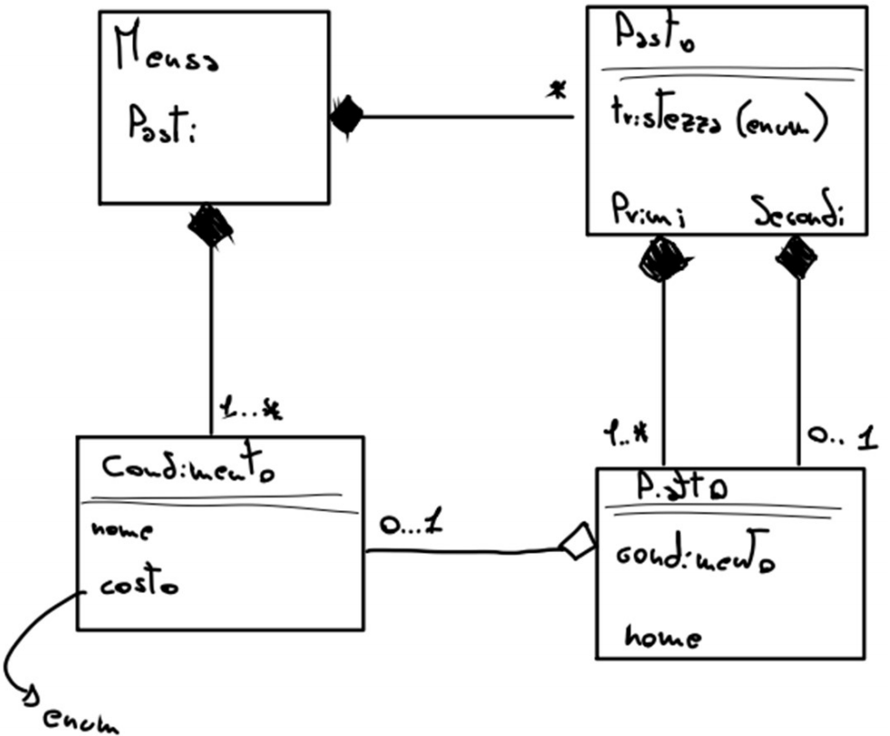

# Simulazione Prog. avanzata - 06
## Teoria
1. Cosa sono e come funzionano le eccezioni? Fai un esempio. Quali sono però i rischi dell’utilizzo delle eccezioni? Elenca infine qualche tipo di eccezione che conosci. 
2. Nell’ambito del multithreading abbiamo studiato l’utilizzo dei mutex; perché sono stati introdotti questi elementi? Che problemi risolvono? Che problemi lasciano invece irrisolti? 
3. Cos’è un move constructor? Cosa lo rende diverso da un copy constructor? Fai un esempio per la classe `CC{ int *pip; }`. Con deep copy, mi raccomando.
4. Cosa sono le lambda expression? Quali funzionalità offrono in più rispetto alle normali funzioni? Quanti tipi di cattura esistono? Fai un esempio di una lambda che prende in input un intero x e cattura un intero accumulatore, la lambda è pensata per accumulare la somma di tutti gli interi di una lista di interi.

## Pratica
5. Dimostra come si mette in sicurezza una variabile dal problema del data race con l’utilizzo della libreria `atomic`. Mostra poi come si può risolvere lo stesso problema tramite i mutex. 
6. Crea una classe `Minestrone{}`, questa deve contenere una lista dinamica di `Verdoora{}`. Fa in modo che siano implementati tutti i metodi di costruttore per copia e spostamento, poi, fa in modo che si possa stampare un Minestrone per verificare che i costruttori di cui sopra funzionino come si deve. 
7. Crea una classe A in cui saranno presenti come attributi privati i seguenti:
   
    * `const int ci`
    * `const float cf`
    * `static int si`
    * `static float sf`
  
    Fa in modo che si possano inizializzare i valori costanti con un costruttore. Inizializza si a 42 e sf a 3.14. Crea un metodo per stampare gli attributi statici.
8. Butta un occhio all'UML sotto: crea una classe condimento, con nome e costo. Crea una classe piatto, con nome ed eventuale condimento. Crea una classe Pasto, può contenere da 1 a n primi (lista) e può contenere anche un secondo. Infine crea una classe Mensa con una lista di pasti ed una di condimenti possibili. Rispettando lo schemino crea tutti i costruttori ma non creare costruttori a 0 parametri. Fa in modo che Pasto sia stampabile (stampando tutti i primi e, se presente, anche il secondo). 

    